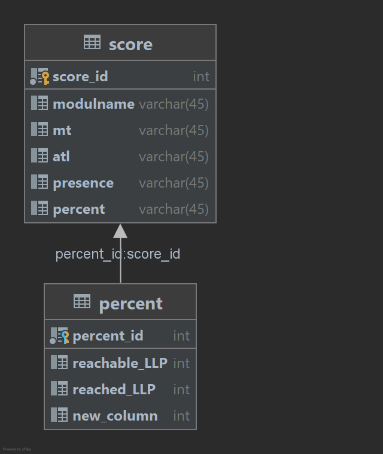

# ATL PE-A: LLP-Verwaltung

## Beschreibung
Zurzeit wird von der HF-ICT Zeus als Notenverwaltungssoftware verwendet. Die Dozenten können dort die erreichten LLPs von den Studenten eintragen. Die Studenten können im Zeus die erreichten LLPs ansehen. Leider fehlt aus meiner Sicht eine wichtige Funktion. Es ist schwer für Studenten seine Leistungen richtig einzuschätzen. Das normale Notensystem mit 1-6 wäre übersichtlicher. Im Zeus sieht man zwar wie viele LLPs man erreicht hat, aber nicht wieviel Protenz. Durch einen Prozent Wert kann man als Student sofort auf dem ersten Blick sehen in welchen Modulen man schlecht und in welchen man gut abgeschlossen hat.

An diese Stelle kommt die LLP-Verwaltung im Einsatz. In dieser Software kann man die Module und die erreichten LLPs eintragen. Das Programm berechnet dann anhand der eingegeben Werte den Prozentzsatz aus.

## Anleitung
Die Applikation kann direkt von GitHub geöffnet werden. Im IntelliJ werden die benötigten Komponenten automatisch heruntergeladen. Alle benötigten Komponenten sind als Maven Dependency angegeben.

#### verwendete Technologien:
* Java JDK 16.0.2
* Maven 4.0.0
* JavaFX 13
* Hibernate 4.2.8
* MySql Connector 5.1.27
* JUnit 4.13.2

## Komponente
Die Applikation ist in Application, Logic, Model und Test aufgeteilt.

### Application
In der Application befindet sich die Main Klasse, die zum Starten der Applikation dient.Zusätzlich ist der MainController zum Verknüpfen von den JavaFx Elementen in diesem Package zu finden.
Alle Operationen werden aus dieser Klasse aus gesteuert. 

### Logic
Im Logic Package befinden sich wie der Name bereits verrät die Business Logik. Im JpaController werden die CRUD Befehle ausgeführt. Der Parser sorgt für die Komma Trennungen und der PercentCalculator ist schlussendlich für die Berechnung zuständig.

### Model
Im Package Model befinden sich die Objekte Score und Percent. Zusätzlich ist ein Scores Objekt implementiert worden. In diesem Objekt werden alle Score Obejekte in einer ArrayListe abgespeichert. Dadurch kann man solang das Programm gestartet hat, Werte einpflegen und rauslöschen. Diese Werte bleiben aber nur im RAM. Die direkte ORM Anbindung funktioniert leider nicht.

### Test
Im Test Package sind jeweils JUnit Tests zu finden. Der JpaControllerTest überprüeft die CRUD Befehle. Da die ORM Implementierung nicht funktioniert, werden die Tests immer fehlschlagen. In der ParserTest Klasse werden die Komma Trennungen und das zusammen addieren getestet. In der PercentCalculatorTest Klasse wird die Hauptfunktion von dieser Applikation überprüft. 

## Datenbank
Die Datenbank wurde sehr einfach gestaltet. Die eingegebenen Score Objekte sollten abgespeichert werden. Ein Score Objekt steht in einer OneToOne Beziehung mit einem Precent Objekt. Im Precent Objekt werden die erreichbaren und die erreichten LLPs in Total abgespeichert. Diese Werte werden für die Berechnung vom Prozentsatz verwendet.

## Verbesserungen
Wenn ich mehr Zeit gehabt hätte, würde ich das Projekt nochmals neu bauen. Ich bin mit der Architektur von meiner Applikation nicht zufrieden. Erst nach der Implementation habe ich versucht die Datenbank zu integrieren. Dementsprechend habe ich zu Beginn die ganze Architektur nur für den RAM Speicher vorgesehen. Ich habe den Punkt mit JPA/Hibernate deutlich unterschätzt. Der Aufbau und die Architektur von der Applikation ist nicht gut gewählt. Wenn ich mehr Zeit gehabt hätte, hätte ich die ArrayList mit den Scores nicht implementiert. Diese Klasse ist für eine Software mit ORM unnötig. Die Kommunikation kann direkt über die Datenbank laufen. Leider war ich aus zeitlichen Gründen nicht mehr in der Lage das Programm richtig umzuschreiben. 