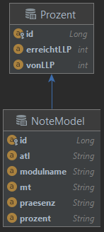

# ATL PE-A: LLP-Verwaltung

## Beschreibung
Zurzeit wird von der HF-ICT Zeus als Notenverwaltungssoftware verwendet. Die Dozenten können dort die erreichten LLPs von den Studenten eintragen. Die Studenten können im Zeus die erreichten LLPs ansehen. Leider fehlt aus meiner Sicht eine wichtige Funktion. Es ist schwer für Studenten seine Leistungen richtig einzuschätzen. Das normale Notensystem mit 1-6 wäre übersichtlicher. Im Zeus sieht man zwar wie viele LLPs man erreicht hat, aber nicht wieviel Protenz. Durch einen Prozent Wert kann man als Student sofort auf dem ersten Blick sehen in welchen Modulen man schlecht und in welchen man gut abgeschlossen hat.

An diese Stelle kommt die LLP-Verwaltung im Einsatz.

## Anleitung
Anleitung wie deine Software gestartet, getestet und genutzt werden kann

Die Applikation kann direkt von GitHub geöffnet werden. Im IntelliJ werden die benötigten Komponenten automatisch heruntergeladen.

## Komponente
Wenn nötig und sinnvoll, beschreibe einzelne Komponenten deiner Software

Die Applikation ist in Application, Logic, Model und Test aufgeteilt. 

###Application
In der Application befindet sich die Main Klasse zum starten der Applikation.
Ebenfalls befindet sich der MainController in diesem Verzeichnis. 

###Logic
Im Logic Package befinden sich die eigentlichen Berechnungen statt.

###Model
Im Package Model befinden sich die Objekte NoteModel und Prozent. 

###Test
Im Test Package sind jeweils JUnit Tests zu finden.

#### verwendete Technologien:
* Java JDK 16.0.2
* Maven 4.0.0
* JavaFX 13
* Hibernate 4.2.8
* MySql Connector 5.1.27
* JUnit 4.13.2

## Mehr Zeit
Wenn ich mehr Zeit gehabt hätte, würde ich das Projekt nochmals neu bauen. Ich bin mit der Architektur von meiner Applikation nicht zufrieden.
Erst nach der Implementation habe ich versucht die Datenbank zu integrieren. Ich habe den Punkt mit JPA/Hibernate unterschätzt. Der Aufbau und die Architektur von der Applikation ist nicht gut gewählt. 
